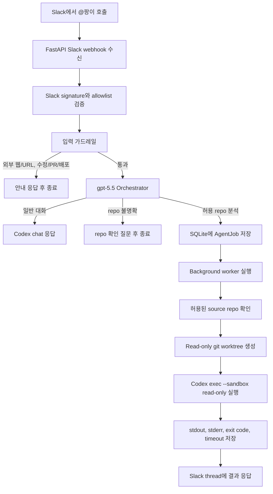

# Pangi

팡이는 PopPang 팀 전용 Slack 기반 개발 에이전트입니다.

Slack에서 `@팡이`를 부르면 팡이는 기본적으로 AI 대화로 답합니다.
허용된 PopPang repo를 명확히 분석해달라고 요청하면, 안전한 read-only worktree를 만든 뒤 Codex CLI로 코드를 읽고 결과를 Slack thread에 답합니다.

```text
팡이가 먼저 읽고, 팀이 더 빠르게 판단합니다.
```

## 목표

1차 MVP의 목표는 아래 흐름을 안정적으로 완성하는 것입니다.



현재 단계에서 팡이는 코드를 수정하지 않습니다. 일반 대화는 repo job 없이 답하고, repo 분석 요청은 코드를 읽고 확인한 사실과 근거를 정리하는 역할에 집중합니다.
외부 웹/인터넷 URL 분석은 서버 부하와 보안 이유로 지원하지 않습니다.

## 현재 구현된 것

- FastAPI 앱과 `/health` 상태 확인
- Slack Events API와 slash command 수신
- Slack request signature 검증
- Slack user/channel allowlist
- repo allowlist와 worktree root 설정
- Slack app mention 정규화와 retry 중복 방지
- 입력 가드레일 기반 외부 웹/쓰기 요청 조기 차단
- gpt-5.5 orchestrator adapter
- Codex chat 응답 경로
- 외부 웹/인터넷 분석 요청 차단
- SQLite 기반 `SlackThread`, `AgentJob`, `CodexRun` 저장소
- in-process background worker
- job 상태 전환: `queued`, `running`, `succeeded`, `failed`, `timed_out`, `cancelled`
- repo별/전체 동시 실행 제한
- read-only 분석용 git worktree 생성
- `develop` branch 우선, 없으면 `main` branch fallback
- `codex exec --sandbox read-only` 실행
- Codex stdout/stderr/exit code/timeout 저장
- Slack thread에 성공/실패/timeout 결과 응답
- Slack 원본 메시지에 `eyes` reaction 추가, 일반 대화와 read-only 분석 응답 성공 시 `white_check_mark`로 전환
- Slack/외부 출력 전 secret redaction과 길이 제한
- 관리자 DB 확인 페이지 `/pangi-admin/db`

## 아직 남은 것

- 실제 Slack 환경 end-to-end 검증
- worktree cleanup 정책
- PR 승인 전 diff 수집/검토 흐름
- Notion 기록
- 코드 수정 승인 흐름
- PR 생성 흐름

## 로컬 실행

```bash
cd pangi
python3 -m venv .venv
source .venv/bin/activate
python -m pip install --upgrade pip
python -m pip install -r requirements.txt
python -m pip install -e .
cp .env.example .env
```

`.env`를 로컬 환경에 맞게 채운 뒤 실행합니다.

```bash
uvicorn pangi.app:app --reload --port 8000
```

상태 확인:

```bash
curl http://127.0.0.1:8000/health
```

정상 응답:

```json
{"status":"ok"}
```

## 환경변수

실제 secret은 `.env` 또는 배포 환경에만 저장합니다. `.env`는 git에 올리지 않습니다.

필수 값:

```env
SLACK_SIGNING_SECRET=
SLACK_BOT_TOKEN=
SLACK_ALLOWED_USER_IDS=
SLACK_ALLOWED_CHANNEL_IDS=
PANGI_ALLOWED_REPOS=
PANGI_WORKTREE_ROOT=
PANGI_SOURCE_REPO_ROOT=
```

선택 값:

```env
PANGI_DEFAULT_BASE_BRANCH=develop
PANGI_JOB_TIMEOUT_SECONDS=600
PANGI_CHAT_TIMEOUT_SECONDS=120
PANGI_CHAT_WORKSPACE_ROOT=
OPENAI_API_KEY=
PANGI_ORCHESTRATOR_MODEL=gpt-5.5
PANGI_ORCHESTRATOR_REASONING_EFFORT=medium
PANGI_ORCHESTRATOR_SERVICE_TIER=default
PANGI_ENABLE_ADMIN_PAGES=0
PANGI_ADMIN_PASSWORD=
```

`OPENAI_API_KEY`가 있으면 입력 가드레일을 통과한 요청을 gpt-5.5 orchestrator로 분류합니다. 없으면 로컬 개발과 테스트를 위해 deterministic orchestrator로 fallback합니다.

임시 개발 환경에서 모든 Slack user/channel을 허용하려면 `*`를 사용할 수 있습니다.

```env
SLACK_ALLOWED_USER_IDS=*
SLACK_ALLOWED_CHANNEL_IDS=*
```

repo allowlist 예시:

```env
PANGI_SOURCE_REPO_ROOT=/home/poppang/repos
PANGI_ALLOWED_REPOS=PopPang-iOS=/home/poppang/repos/PopPang-iOS
PANGI_WORKTREE_ROOT=/home/poppang/worktrees
```

branch 선택은 단순합니다.

```text
1. origin/develop 시도
2. develop이 없으면 origin/main 시도
3. 둘 다 없으면 job 실패
```

## Slack 앱 권한

Bot Token Scopes 최소 권한:

```text
app_mentions:read
chat:write
reactions:write
```

scope를 바꾼 뒤에는 Slack 앱을 workspace에 다시 설치해야 변경이 적용됩니다.

## Codex CLI

팡이 서버를 실행하는 계정에 Codex CLI가 설치되어 있어야 합니다.

```bash
curl -fsSL https://chatgpt.com/codex/install.sh | CODEX_NON_INTERACTIVE=1 sh
export PATH="$HOME/.local/bin:$PATH"
codex --version
codex login --device-auth
```

서버에서 확인:

```bash
cd /path/to/git/repo
codex exec --sandbox read-only "이 저장소 구조를 한 문단으로 요약해줘"
```

Codex는 git repo 안에서 실행되어야 합니다. 팡이는 job마다 git worktree를 만들고 그 안에서 Codex를 실행합니다.
일반 대화 응답은 repo worktree가 아니라 `PANGI_CHAT_WORKSPACE_ROOT`에서 `codex exec --skip-git-repo-check --sandbox read-only`로 실행합니다.

## 관리자 페이지

관리자 DB 확인 페이지는 기본 비활성화입니다.

```env
PANGI_ENABLE_ADMIN_PAGES=1
PANGI_ADMIN_PASSWORD=change-this-password
```

실행 후 접속:

```text
http://127.0.0.1:8000/pangi-admin/login
```

## 테스트

```bash
cd pangi
source .venv/bin/activate
pytest
```

## 안전 원칙

- `.env`, token, signing secret, Codex auth 파일을 git에 올리지 않습니다.
- Slack user/channel/repo allowlist를 강제합니다.
- 사용자의 Slack 메시지를 shell command로 직접 실행하지 않습니다.
- 외부 명령은 argv list로 실행하고 `shell=True`를 사용하지 않습니다.
- Codex 분석은 `--sandbox read-only`로 실행합니다.
- Codex는 원본 source repo가 아니라 job별 worktree에서 실행합니다.
- 코드 수정과 PR 생성은 Slack 승인 흐름이 붙은 뒤에만 구현합니다.

## 문서

- [MVP 개요](docs/mvp/overview.md)
- [구현 체크리스트](docs/implementation-checklist.md)
- [안전 규칙](docs/security/safety-rules.md)
- [아키텍처 문서](docs/architecture/)

## 구조

```text
pangi/
  README.md
  pyproject.toml
  requirements.txt
  src/pangi/
    app.py
    config/
    domain/
    usecase/
    repository/
    infra/
      slack/
      queue/
      git/
      codex/
      admin/
      logger/
      approvals/
  tests/

docs/
  mvp/
  architecture/
  security/
  reference/
```

주요 책임은 아래처럼 나눕니다.

```text
config/       환경변수와 설정
domain/       핵심 모델과 정책
usecase/      Slack 요청 접수, 분석 job 실행, prompt 생성
repository/   저장소 Protocol과 SQLite 구현
infra/        Slack API, queue, git, Codex, admin route 같은 외부 adapter
```
