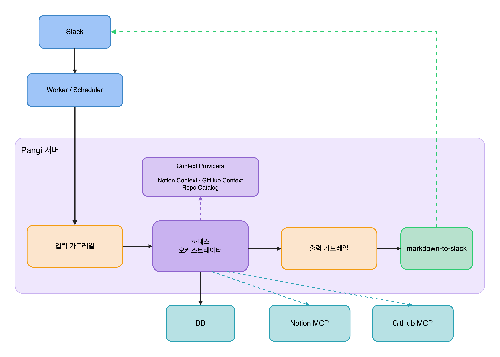
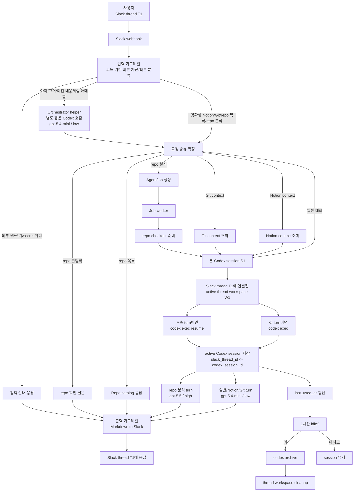
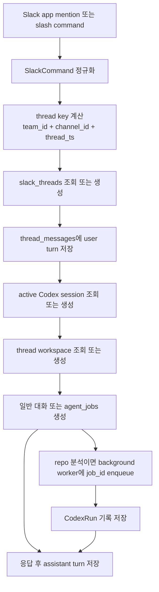

# Pangi

팡이는 PopPang 팀 전용 Slack 기반 개발 에이전트입니다.

Slack에서 `@팡이`를 부르면 팡이는 기본적으로 AI 대화로 답합니다.
허용된 PopPang repo를 명확히 분석해달라고 요청하면, Slack thread와 1:1로 대응되는 Codex session과 thread workspace를 사용해 코드를 읽고 결과를 Slack thread에 답합니다.

```text
팡이가 먼저 읽고, 팀이 더 빠르게 판단합니다.
```

## 아키텍처



## 지금 팡이가 할 수 있는 것

- Slack에서 `@팡이` mention과 slash command 요청을 받을 수 있습니다.
- 허용된 user/channel과 `PANGI_SOURCE_REPO_ROOT` 하위 repo만 처리합니다.
- 인사나 자기소개 요청에는 팡이가 누구이고 무엇을 할 수 있는지 짧게 소개합니다.
- 일반 대화, 문장 정리, repo를 직접 읽지 않는 간단한 판단은 Codex chat으로 답합니다.
- 허용된 PopPang repo 이름이 명시된 분석 요청은 SQLite job으로 저장하고, 같은 Slack thread의 active Codex session과 thread workspace를 사용해 `codex exec --sandbox read-only`로 코드를 읽은 뒤 Slack thread에 결과를 남깁니다.
- Notion 문서/회의록 읽기 요청은 repo 분석과 분리된 `notion_context_chat` 흐름으로 분류합니다. 관리자 페이지에서 Notion OAuth 연결을 마치면 허용된 Notion context만 Codex chat prompt에 붙입니다.
- GitHub/Git의 PR, issue, Actions, commit 맥락 요청은 repo 분석과 분리된 `git_context_chat` 흐름으로 분류합니다. Git MCP가 연결되면 read-only Git context만 Codex chat prompt에 붙입니다.
- 분석 가능한 repo 목록 요청은 `repo_catalog` 흐름으로 분류하고, Git MCP 조직 repo와 `PANGI_SOURCE_REPO_ROOT` 하위 로컬 clone을 함께 보여줍니다. 로컬에 없는 조직 repo는 분석 요청 시 source root 아래로 clone합니다.
- 외부 웹/URL 분석, 코드 수정, PR 생성, 배포, commit/push 요청은 입력 가드레일에서 차단하고 안내 응답만 보냅니다.
- 요청을 받으면 원본 Slack 메시지에 `eyes` reaction을 달고, 일반 대화나 read-only 분석 응답에 성공하면 `white_check_mark`로 전환합니다. 실패나 timeout은 `x`로 전환합니다.
- 관리자 페이지에서 `once`, `daily`, `weekly` 스케줄을 등록하면 정해진 시간에 기존 Slack 요청 처리 흐름으로 자동 실행할 수 있습니다.
- Eval suite로 입력 가드레일, provider 호출, Codex read-only 경계, Red Team case를 deterministic하게 검증할 수 있습니다.
- 관리자 DB 확인 페이지에서 Slack thread, job, Codex run 기록을 확인할 수 있습니다.

## 팡이의 생명력을 바꾸는 곳

팡이의 말투, 판단 감각, PopPang다운 개발/디자인 스타일은 prompt 파일에서 조정합니다.

- `pangi/src/pangi/prompts/pangi_agent.md`: 팡이의 공통 성격, 답변 톤, 코드/개발/커밋/디자인 감각
- `pangi/src/pangi/prompts/chat.md`: repo를 읽지 않는 일반 대화 모드
- `pangi/src/pangi/prompts/read_only_analysis.md`: repo를 read-only로 읽고 분석하는 모드
- `pangi/src/pangi/prompts/orchestrator.md`: 입력 가드레일이 애매하다고 남긴 요청을 보조 판정하는 AI Orchestrator 규칙

팡이의 "생명력"을 더 넣고 싶다면 먼저 `pangi_agent.md`를 수정합니다. 코드 기반 1차 판정 기준은 `pangi/src/pangi/usecase/input_guardrail.py`와 `docs/architecture/input-guardrail.md`에서 관리하고, AI 보조 판정 기준을 바꾸고 싶을 때만 `orchestrator.md`를 수정합니다.

## 목표

1차 MVP의 목표는 아래 흐름을 안정적으로 완성하는 것입니다.



현재 단계에서 팡이는 코드를 수정하지 않습니다. 일반 대화는 repo job 없이 답하고, repo 분석 요청은 코드를 읽고 확인한 사실과 근거를 정리하는 역할에 집중합니다.
외부 웹/인터넷 URL 분석은 서버 부하와 보안 이유로 지원하지 않습니다.

## 현재 구현된 것

- FastAPI 앱과 `/health` 상태 확인
- Slack Events API와 slash command 수신
- Slack request signature 검증
- Slack user/channel allowlist
- source repo root 자동 탐색과 worktree root 설정
- Slack app mention 정규화와 retry 중복 방지
- Slack app mention 빠른 ACK와 background 처리
- 입력 가드레일 기반 외부 웹/쓰기 요청 조기 차단과 1차 라우팅
- Notion 문서 읽기 요청의 별도 분류와 공식 MCP 기반 Notion context provider
- Git MCP context 요청과 repo catalog 요청의 별도 분류
- Git MCP toolset 고정 기반 deterministic adapter
- 애매한 요청만 처리하는 Codex CLI 기반 orchestrator adapter
- Slack thread별 active Codex session 생성/재사용
- Slack thread별 active thread workspace 생성/재사용
- thread workspace 내부 repo checkout 생성
- Codex chat 응답 경로
- 외부 웹/인터넷 분석 요청 차단
- SQLite 기반 `SlackThread`, `CodexSession`, `AgentJob`, `CodexRun`, `ScheduledTask`, `ScheduledTaskRun` 저장소
- in-process background worker
- in-process scheduler와 예약 실행 기록
- job 상태 전환: `queued`, `running`, `succeeded`, `failed`, `timed_out`, `cancelled`
- repo별/전체 동시 실행 제한
- 1시간 idle session archive와 thread workspace cleanup sweeper
- `develop` branch 우선, 없으면 `main` branch fallback
- `codex exec` / `codex exec resume` / `codex archive` 실행
- Codex stdout/stderr/exit code/timeout/session id 저장
- Slack thread에 성공/실패/timeout 결과 응답
- Slack 원본 메시지에 `eyes` reaction 추가, 일반 대화와 read-only 분석 응답 성공 시 `white_check_mark`로 전환
- Slack/외부 출력 전 secret redaction과 길이 제한
- Slack bot 응답 전용 Markdown to Slack 변환
- 관리자 DB 확인 페이지 `/pangi-admin/db`
- 관리자 홈 페이지 `/pangi-admin`
- 관리자 MCP 상태 페이지 `/pangi-admin/mcp`
- 관리자 Notion OAuth 연결 페이지 `/pangi-admin/notion`
- 관리자 스케줄 페이지 `/pangi-admin/schedules`
- Eval runner `PYTHONPATH=src python3 -m pangi.evaluations.run`

## 아직 남은 것

- 실제 Slack 환경 end-to-end 검증
- session archive / workspace cleanup 운영 정책 고도화
- PR 승인 전 diff 수집/검토 흐름
- Notion DB context 선별 품질 고도화
- Notion episode report 기록
- 코드 수정 승인 흐름
- PR 생성 흐름

## AgentJob과 thread 관리

팡이는 Slack thread를 독립된 대화 단위로 보고, user/assistant turn을 `thread_messages`에 저장합니다. 다만 실행 연속성의 기본축은 `최근 대화 재주입`이 아니라 `Slack thread 1개 = active Codex session 1개`입니다.



같은 Slack thread 안의 일반 대화와 repo 분석은 같은 Codex session과 thread workspace를 공유합니다. 1시간 이상 idle이면 session을 archive한 뒤 다음 요청에서 새 session으로 다시 시작합니다.

### ThreadMessage가 저장하는 것

`thread_messages`는 같은 Slack thread 안의 user/assistant turn을 저장합니다.

| 정보 | 설명 |
| --- | --- |
| 대화 위치 | `slack_thread_id` |
| 발화자 | `role` (`user`, `assistant`) |
| 본문 | `text` |
| Slack 원본 | `message_ts`, `event_id` |
| 연결 job | `source_job_id` |

`thread_messages`는 주로 관리자 확인과 감사 로그 역할을 맡습니다. 일반 대화와 repo 분석은 Codex session을 이어가므로, 최근 대화 전체를 매 turn마다 prompt에 다시 넣지 않습니다.

### CodexSession이 저장하는 것

`codex_sessions`는 같은 Slack thread에 연결된 active Codex session을 추적합니다.

| 정보 | 설명 |
| --- | --- |
| 대화 위치 | `slack_thread_id` |
| 실제 Codex session | `codex_thread_id` |
| thread workspace | `workspace_path` |
| 상태 | `status` (`active`, `expired`, `archived`, `archive_failed`) |
| 만료 정보 | `last_used_at`, `expires_at`, `archived_at` |

### AgentJob이 저장하는 것

`AgentJob`은 Slack 요청을 실행 가능한 background job으로 바꾼 기록입니다.

| 정보 | 설명 |
| --- | --- |
| Slack 위치 | `slack_thread_id`, `slack_team_id`, `slack_channel_id`, `slack_thread_ts` |
| 연결 session | `codex_session_id` |
| 원본 메시지 | `slack_message_ts`, `requester_user_id`, `prompt` |
| 실행 대상 | `repo_key`, `job_type` |
| 실행 상태 | `status`, `worktree_path`, `stdout`, `stderr`, `error_message` |

## SQLite 테이블 구조

현재 SQLite 구현 기준은 `pangi/src/pangi/repository/job_repository_sqlite_impl.py`입니다.

### `slack_threads`

| 컬럼 | 타입 | 제약 | 설명 |
| --- | --- | --- | --- |
| `id` | `TEXT` | `PRIMARY KEY` | 내부 Slack thread id |
| `team_id` | `TEXT` | `NOT NULL` | Slack team id |
| `channel_id` | `TEXT` | `NOT NULL` | Slack channel id |
| `thread_ts` | `TEXT` | `NOT NULL` | Slack thread timestamp |
| `last_job_id` | `TEXT` |  | 마지막으로 연결된 job id |
| `active_codex_session_id` | `TEXT` |  | 현재 thread에 연결된 active Codex session id |
| `created_at` | `TEXT` | `NOT NULL` | 생성 시각 |
| `updated_at` | `TEXT` | `NOT NULL` | 수정 시각 |

### `codex_sessions`

| 컬럼 | 타입 | 제약 | 설명 |
| --- | --- | --- | --- |
| `id` | `TEXT` | `PRIMARY KEY` | 내부 session id |
| `slack_thread_id` | `TEXT` | `NOT NULL`, `FOREIGN KEY` | `slack_threads.id` 참조 |
| `codex_thread_id` | `TEXT` | `NOT NULL`, `UNIQUE` | Codex CLI가 돌려준 실제 session id |
| `workspace_path` | `TEXT` | `NOT NULL` | thread workspace root 경로 |
| `status` | `TEXT` | `NOT NULL` | session 상태 |
| `last_used_at` | `TEXT` | `NOT NULL` | 마지막 사용 시각 |
| `expires_at` | `TEXT` | `NOT NULL` | idle timeout 만료 시각 |
| `archived_at` | `TEXT` |  | archive 완료 시각 |
| `created_at` | `TEXT` | `NOT NULL` | 생성 시각 |
| `updated_at` | `TEXT` | `NOT NULL` | 수정 시각 |

### `thread_messages`

| 컬럼 | 타입 | 제약 | 설명 |
| --- | --- | --- | --- |
| `id` | `TEXT` | `PRIMARY KEY` | 내부 message id |
| `slack_thread_id` | `TEXT` | `NOT NULL`, `FOREIGN KEY` | `slack_threads.id` 참조 |
| `role` | `TEXT` | `NOT NULL` | `user` 또는 `assistant` |
| `text` | `TEXT` | `NOT NULL` | 대화 본문 |
| `message_ts` | `TEXT` |  | Slack message timestamp |
| `event_id` | `TEXT` | `UNIQUE` | Slack retry 중복 방지용 event id |
| `source_job_id` | `TEXT` | `FOREIGN KEY` | 연결된 `agent_jobs.id` |
| `created_at` | `TEXT` | `NOT NULL` | 생성 시각 |

### `agent_jobs`

| 컬럼 | 타입 | 제약 | 설명 |
| --- | --- | --- | --- |
| `id` | `TEXT` | `PRIMARY KEY` | 내부 job id |
| `event_id` | `TEXT` | `NOT NULL`, `UNIQUE` | Slack event id 또는 slash command trigger id |
| `slack_thread_id` | `TEXT` | `NOT NULL`, `FOREIGN KEY` | `slack_threads.id` 참조 |
| `codex_session_id` | `TEXT` | `FOREIGN KEY` | `codex_sessions.id` 참조 |
| `slack_team_id` | `TEXT` | `NOT NULL` | Slack team id |
| `slack_channel_id` | `TEXT` | `NOT NULL` | Slack channel id |
| `slack_thread_ts` | `TEXT` | `NOT NULL` | Slack thread timestamp |
| `slack_message_ts` | `TEXT` |  | 원본 app mention message timestamp |
| `requester_user_id` | `TEXT` | `NOT NULL` | 요청한 Slack user id |
| `job_type` | `TEXT` | `NOT NULL` | job 종류 |
| `status` | `TEXT` | `NOT NULL` | job 상태 |
| `repo_key` | `TEXT` | `NOT NULL` | allowlist에 등록된 repo key |
| `prompt` | `TEXT` | `NOT NULL` | 사용자 요청 원문 |
| `worktree_path` | `TEXT` |  | thread workspace 안에서 실제로 분석한 repo checkout 경로 |
| `stdout` | `TEXT` |  | Codex 실행 stdout |
| `stderr` | `TEXT` |  | Codex 실행 stderr |
| `error_message` | `TEXT` |  | 실패 요약 메시지 |
| `created_at` | `TEXT` | `NOT NULL` | 생성 시각 |
| `updated_at` | `TEXT` | `NOT NULL` | 수정 시각 |

### `codex_runs`

| 컬럼 | 타입 | 제약 | 설명 |
| --- | --- | --- | --- |
| `id` | `TEXT` | `PRIMARY KEY` | 내부 Codex run id |
| `job_id` | `TEXT` | `NOT NULL`, `FOREIGN KEY` | `agent_jobs.id` 참조 |
| `codex_session_id` | `TEXT` | `FOREIGN KEY` | `codex_sessions.id` 참조 |
| `mode` | `TEXT` | `NOT NULL` | Codex 실행 모드 |
| `command` | `TEXT` | `NOT NULL` | 실행한 argv list의 JSON 문자열 |
| `prompt` | `TEXT` | `NOT NULL` | Codex에 전달한 prompt |
| `stdout` | `TEXT` |  | Codex stdout |
| `stderr` | `TEXT` |  | Codex stderr |
| `exit_code` | `INTEGER` |  | 프로세스 종료 코드 |
| `timed_out` | `INTEGER` | `NOT NULL` | timeout 여부, `0` 또는 `1` |
| `workspace_path` | `TEXT` |  | 실제 Codex 실행 workspace root 경로 |
| `started_at` | `TEXT` | `NOT NULL` | 시작 시각 |
| `finished_at` | `TEXT` |  | 종료 시각 |

### `scheduled_tasks`

| 컬럼 | 타입 | 제약 | 설명 |
| --- | --- | --- | --- |
| `id` | `TEXT` | `PRIMARY KEY` | 내부 schedule id |
| `name` | `TEXT` | `NOT NULL` | 관리자용 이름 |
| `enabled` | `INTEGER` | `NOT NULL` | 활성 여부, `0` 또는 `1` |
| `team_id` | `TEXT` | `NOT NULL` | 실행할 Slack team id |
| `channel_id` | `TEXT` | `NOT NULL` | 실행할 Slack channel id |
| `requester_user_id` | `TEXT` | `NOT NULL` | 예약 요청자로 기록할 Slack user id |
| `prompt` | `TEXT` | `NOT NULL` | 예약 실행 때 처리할 요청 본문 |
| `schedule_type` | `TEXT` | `NOT NULL` | `once`, `daily`, `weekly` |
| `timezone` | `TEXT` | `NOT NULL` | IANA timezone 이름 |
| `time_of_day` | `TEXT` |  | 반복 실행 시각, `HH:MM` |
| `days_of_week` | `TEXT` |  | 주간 실행 요일, 월요일 `0`부터 일요일 `6` |
| `run_at` | `TEXT` |  | 1회 실행 UTC 시각 |
| `next_run_at` | `TEXT` |  | 다음 실행 UTC 시각 |
| `last_run_at` | `TEXT` |  | 마지막 실행 예정 UTC 시각 |
| `created_at` | `TEXT` | `NOT NULL` | 생성 시각 |
| `updated_at` | `TEXT` | `NOT NULL` | 수정 시각 |

### `scheduled_task_runs`

| 컬럼 | 타입 | 제약 | 설명 |
| --- | --- | --- | --- |
| `id` | `TEXT` | `PRIMARY KEY` | 내부 schedule run id |
| `scheduled_task_id` | `TEXT` | `NOT NULL`, `FOREIGN KEY` | `scheduled_tasks.id` 참조 |
| `scheduled_for` | `TEXT` | `NOT NULL` | 실행 예정 UTC 시각 |
| `status` | `TEXT` | `NOT NULL` | `claimed`, `submitted`, `succeeded`, `failed` |
| `event_id` | `TEXT` | `NOT NULL`, `UNIQUE` | synthetic event id |
| `slack_thread_ts` | `TEXT` |  | 예약 실행이 만든 Slack root message ts |
| `job_id` | `TEXT` | `FOREIGN KEY` | repo 분석이면 연결된 `agent_jobs.id` |
| `classification` | `TEXT` |  | 기존 요청 분류 결과 |
| `error_message` | `TEXT` |  | 실패 요약 메시지 |
| `created_at` | `TEXT` | `NOT NULL` | 생성 시각 |
| `updated_at` | `TEXT` | `NOT NULL` | 수정 시각 |

`scheduled_task_runs`는 `UNIQUE(scheduled_task_id, scheduled_for)`로 같은 예약 시각의 중복 실행을 막습니다.

## 로컬 실행

```bash
cd pangi
python3 -m venv .venv
source .venv/bin/activate
python -m pip install --upgrade pip
python -m pip install -r requirements.txt
python -m pip install -e .
cp .env.example .env
```

`.env`를 로컬 환경에 맞게 채운 뒤 실행합니다.

```bash
uvicorn pangi.app:app --reload --port 8000
```

상태 확인:

```bash
curl http://127.0.0.1:8000/health
```

정상 응답:

```json
{"status":"ok"}
```

## 환경변수

실제 secret은 `.env` 또는 배포 환경에만 저장합니다. `.env`는 git에 올리지 않습니다.

필수 값:

```env
SLACK_SIGNING_SECRET=
SLACK_BOT_TOKEN=
SLACK_ALLOWED_USER_IDS=
SLACK_ALLOWED_CHANNEL_IDS=
PANGI_WORKTREE_ROOT=
PANGI_SOURCE_REPO_ROOT=
```

선택 값:

```env
PANGI_DEFAULT_BASE_BRANCH=develop
PANGI_JOB_TIMEOUT_SECONDS=600
PANGI_CHAT_TIMEOUT_SECONDS=120
PANGI_CHAT_WORKSPACE_ROOT=
PANGI_PUBLIC_BASE_URL=
PANGI_CHAT_MODEL=gpt-5.4-mini
PANGI_CHAT_REASONING_EFFORT=low
PANGI_ORCHESTRATOR_MODEL=gpt-5.4-mini
PANGI_ORCHESTRATOR_REASONING_EFFORT=low
PANGI_ORCHESTRATOR_TIMEOUT_SECONDS=20
PANGI_ANALYSIS_MODEL=gpt-5.5
PANGI_ANALYSIS_REASONING_EFFORT=high
PANGI_NOTION_ENABLED=0
PANGI_NOTION_MCP_URL=https://mcp.notion.com/mcp
PANGI_NOTION_ALLOWED_PAGE_IDS=
PANGI_NOTION_ALLOWED_DATABASE_IDS=
PANGI_NOTION_CONTEXT_MAX_CHARS=6000
PANGI_NOTION_TIMEOUT_SECONDS=20
PANGI_NOTION_TOKEN_STORE_PATH=
PANGI_NOTION_WRITE_ENABLED=0
PANGI_GIT_MCP_ENABLED=0
PANGI_GIT_MCP_URL=https://api.githubcopilot.com/mcp/
PANGI_GIT_MCP_TOKEN=
PANGI_GIT_MCP_ORG=team-PopPang
PANGI_GIT_MCP_CONTEXT_MAX_CHARS=6000
PANGI_GIT_MCP_TIMEOUT_SECONDS=20
PANGI_GIT_MCP_WRITE_ENABLED=0
PANGI_GIT_CLONE_URL_TEMPLATE=https://github.com/{org}/{repo}.git
PANGI_SCHEDULER_ENABLED=0
PANGI_SCHEDULER_TICK_SECONDS=30
PANGI_ENABLE_ADMIN_PAGES=0
PANGI_ADMIN_PASSWORD=
```

모델은 호출 목적별로 분리합니다.

| 설정 | 기본값 | 역할 |
| --- | --- | --- |
| `PANGI_ORCHESTRATOR_MODEL` | `gpt-5.4-mini` | 입력 가드레일을 통과한 요청을 일반 대화, repo 확인 질문, repo 분석 job으로 라우팅 |
| `PANGI_ORCHESTRATOR_REASONING_EFFORT` | `low` | orchestrator용 Codex 호출의 추론 난이도 |
| `PANGI_CHAT_MODEL` | `gpt-5.4-mini` | repo를 읽지 않는 일반 대화 응답 |
| `PANGI_CHAT_REASONING_EFFORT` | `low` | 일반 대화용 Codex 호출의 추론 난이도 |
| `PANGI_ANALYSIS_MODEL` | `gpt-5.5` | thread workspace 내부 repo checkout에서 실제 repo 코드를 읽는 분석 |
| `PANGI_ANALYSIS_REASONING_EFFORT` | `high` | repo 분석용 Codex 호출의 추론 난이도 |
| `PANGI_PUBLIC_BASE_URL` | 빈 값 | Notion OAuth callback을 받을 공개 서버 URL. 비우면 요청 host 기준으로 callback URL을 만듦 |
| `PANGI_NOTION_ENABLED` | `0` | Notion context provider 사용 여부 |
| `PANGI_NOTION_MCP_URL` | `https://mcp.notion.com/mcp` | 공식 Notion MCP Streamable HTTP endpoint |
| `PANGI_NOTION_ALLOWED_PAGE_IDS` | 빈 값 | 팡이가 읽을 수 있는 Notion page id allowlist |
| `PANGI_NOTION_ALLOWED_DATABASE_IDS` | 빈 값 | 팡이가 읽을 수 있는 Notion database id allowlist |
| `PANGI_NOTION_CONTEXT_MAX_CHARS` | `6000` | Codex prompt에 붙일 Notion context 최대 길이 |
| `PANGI_NOTION_TIMEOUT_SECONDS` | `20` | Notion context 조회 timeout |
| `PANGI_NOTION_TOKEN_STORE_PATH` | 빈 값 | Notion OAuth token store 경로. 비우면 worktree root 아래 `_notion/notion-oauth.json` 사용 |
| `PANGI_NOTION_WRITE_ENABLED` | `0` | 예약 설정값. MVP에서는 Notion write 요청을 지원하지 않음 |
| `PANGI_GIT_MCP_ENABLED` | `0` | Git MCP context provider 사용 여부 |
| `PANGI_GIT_MCP_URL` | `https://api.githubcopilot.com/mcp/` | Git MCP Streamable HTTP endpoint |
| `PANGI_GIT_MCP_CONTEXT_URL` | `https://api.githubcopilot.com/mcp/readonly` | generic Git context fallback toolset URL |
| `PANGI_GIT_MCP_ORGS_URL` | `https://api.githubcopilot.com/mcp/x/orgs/readonly` | repo catalog용 GitHub Organizations toolset URL |
| `PANGI_GIT_MCP_REPOS_URL` | `https://api.githubcopilot.com/mcp/x/repos/readonly` | repo metadata/context용 GitHub Repositories toolset URL |
| `PANGI_GIT_MCP_ISSUES_URL` | `https://api.githubcopilot.com/mcp/x/issues/readonly` | issue context용 GitHub Issues toolset URL |
| `PANGI_GIT_MCP_PULL_REQUESTS_URL` | `https://api.githubcopilot.com/mcp/x/pull_requests/readonly` | PR context용 GitHub Pull Requests toolset URL |
| `PANGI_GIT_MCP_ACTIONS_URL` | `https://api.githubcopilot.com/mcp/x/actions/readonly` | Actions/workflow context용 GitHub Actions toolset URL |
| `PANGI_GIT_MCP_TOKEN` | 빈 값 | Git MCP 인증 token. 실제 값은 `.env` 또는 배포 환경에만 저장 |
| `PANGI_GIT_MCP_ORG` | 빈 값 | repo catalog를 조회할 GitHub organization 이름 |
| `PANGI_GIT_MCP_CONTEXT_MAX_CHARS` | `6000` | Codex prompt에 붙일 Git context 최대 길이 |
| `PANGI_GIT_MCP_TIMEOUT_SECONDS` | `20` | Git MCP context 조회 timeout |
| `PANGI_GIT_MCP_WRITE_ENABLED` | `0` | 예약 설정값. MVP에서는 Git write 요청을 지원하지 않음 |
| `PANGI_GIT_CLONE_URL_TEMPLATE` | `https://github.com/{org}/{repo}.git` | Git MCP 조직 repo가 source root에 없을 때 사용할 clone URL 템플릿 |
| `PANGI_CODEX_SESSION_IDLE_TIMEOUT_SECONDS` | `3600` | Slack thread의 active Codex session idle timeout |
| `PANGI_SCHEDULER_ENABLED` | `0` | 관리자 페이지에 저장된 예약 작업의 자동 실행 여부 |
| `PANGI_SCHEDULER_TICK_SECONDS` | `30` | in-process scheduler가 due schedule을 확인하는 간격 |

입력 가드레일은 AI가 아니라 코드로 유지합니다. Orchestrator는 심층 repo 분석이 아니라 흐름을 정하는 단계이므로 기본 mini 모델과 `low` reasoning을 사용합니다. 팡이가 실행하는 `codex exec`는 `-c model_reasoning_effort="..."`를 명시해, 팡이를 개발하는 사람의 `.codex/config.toml` 설정이 런타임 호출에 섞이지 않게 합니다.

Scheduler는 Codex runner를 직접 호출하지 않고, 시간이 된 예약 작업을 synthetic Slack request로 만들어 기존 입력 가드레일과 `SubmitSlackRequestUseCase` 흐름을 통과시킵니다. 자세한 기준은 [docs/architecture/scheduler.md](docs/architecture/scheduler.md)를 봅니다.

Notion context는 공식 Notion MCP를 직접 Codex에 열지 않고, 팡이 서버가 허용된 page/database만 read-only로 조회한 뒤 Markdown context로 정규화해서 Codex chat prompt에 붙이는 구조입니다. Notion 연결은 관리자 페이지 `/pangi-admin/notion`에서 OAuth로 진행합니다. 자세한 기준은 [docs/architecture/notion-context.md](docs/architecture/notion-context.md)를 봅니다.

Git context도 Codex에 Git MCP 권한을 직접 열지 않고, 팡이 서버가 GitHub MCP의 toolset을 기능별로 고정해서 read-only 조회한 뒤 Markdown context로 정규화해서 Codex chat prompt에 붙이는 구조입니다. `repo_catalog`는 조직 검색 자체가 아니라 조직 아래 **repository 목록**을 목표로 하므로 `repos` toolset을 우선 사용하고, PR은 `pull_requests`, issue는 `issues`, Actions는 `actions`, 일반 repo 메타데이터는 `repos` toolset을 우선 사용합니다. 실제 코드 전체 분석은 `PANGI_SOURCE_REPO_ROOT` 하위 source repo와 thread workspace 내부 repo checkout에서 수행합니다. Git MCP 조직 repo가 아직 source root에 없으면, 분석 요청 시 `PANGI_GIT_CLONE_URL_TEMPLATE`으로 clone한 뒤 thread workspace 아래 detached checkout을 만듭니다.

임시 개발 환경에서 모든 Slack user/channel을 허용하려면 `*`를 사용할 수 있습니다.

```env
SLACK_ALLOWED_USER_IDS=*
SLACK_ALLOWED_CHANNEL_IDS=*
```

source repo root 예시:

```env
PANGI_SOURCE_REPO_ROOT=/home/poppang/admin/pangi/repos
PANGI_WORKTREE_ROOT=/home/poppang/admin/pangi/.data/worktrees
```

`PANGI_SOURCE_REPO_ROOT` 아래 direct child 디렉터리 이름을 그대로 repo key로 사용합니다.
예를 들어 `/home/poppang/admin/pangi/repos/PopPang-iOS`가 있으면 Slack에서는 `PopPang-iOS`로 요청할 수 있습니다.

branch 선택은 단순합니다.

```text
1. origin/develop 시도
2. develop이 없으면 origin/main 시도
3. 둘 다 없으면 job 실패
```

## Slack 앱 권한

Bot Token Scopes 최소 권한:

```text
app_mentions:read
chat:write
reactions:write
```

scope를 바꾼 뒤에는 Slack 앱을 workspace에 다시 설치해야 변경이 적용됩니다.

## Codex CLI

팡이 서버를 실행하는 계정에 Codex CLI가 설치되어 있어야 합니다.

```bash
curl -fsSL https://chatgpt.com/codex/install.sh | CODEX_NON_INTERACTIVE=1 sh
export PATH="$HOME/.local/bin:$PATH"
codex --version
codex login --device-auth
```

서버에서 확인:

```bash
cd /path/to/git/repo
codex exec --sandbox read-only "이 저장소 구조를 한 문단으로 요약해줘"
```

팡이는 Slack thread마다 thread workspace를 만들고, 첫 turn은 `codex exec`, 후속 turn은 `codex exec resume`으로 이어갑니다. repo 분석은 thread workspace 내부 repo checkout을 대상으로 읽고, 일반 대화도 같은 thread workspace를 공유합니다.

## 관리자 페이지

관리자 페이지는 기본 비활성화입니다.

```env
PANGI_ENABLE_ADMIN_PAGES=1
PANGI_ADMIN_PASSWORD=change-this-password
```

실행 후 접속:

```text
http://127.0.0.1:8000/pangi-admin
```

로그인하면 관리자 홈에서 DB 기록, 스케줄, MCP 상태, Notion 연결 화면으로 이동할 수 있습니다.
`/pangi-admin/mcp`에서는 Notion/Git MCP 설정과 endpoint 목록을 확인할 수 있으며 token 값은 표시하지 않습니다.

Notion context를 사용하려면 관리자 로그인 후 아래 주소에서 OAuth 연결을 완료합니다.

```text
http://127.0.0.1:8000/pangi-admin/notion
```

운영 서버에서는 `PANGI_PUBLIC_BASE_URL`을 외부에서 접근 가능한 팡이 서버 URL로 설정해야 Notion OAuth callback이 돌아올 수 있습니다.

## 테스트

```bash
cd pangi
source .venv/bin/activate
pytest
```

프롬프트, 모델, provider, toolset 변경 후에는 Eval도 함께 실행합니다.

```bash
cd pangi
source .venv/bin/activate
PYTHONPATH=src python3 -m pangi.evaluations.run
```

Eval은 정답 채점기가 아니라 팡이가 의도한 실행 경계 안에서 움직였는지 검증합니다.
자세한 기준은 [docs/architecture/evaluations.md](docs/architecture/evaluations.md)를 봅니다.

## 안전 원칙

- `.env`, token, signing secret, Codex auth 파일을 git에 올리지 않습니다.
- Slack user/channel allowlist와 `PANGI_SOURCE_REPO_ROOT` 하위 repo 제한을 강제합니다.
- 사용자의 Slack 메시지를 shell command로 직접 실행하지 않습니다.
- 외부 명령은 argv list로 실행하고 `shell=True`를 사용하지 않습니다.
- Codex 분석은 `--sandbox read-only`로 실행합니다.
- Codex는 원본 source repo가 아니라 thread workspace에서 실행합니다.
- 코드 수정과 PR 생성은 Slack 승인 흐름이 붙은 뒤에만 구현합니다.

## 문서

- [MVP 개요](docs/mvp/overview.md)
- [구현 체크리스트](docs/implementation-checklist.md)
- [안전 규칙](docs/security/safety-rules.md)
- [아키텍처 문서](docs/architecture/)

## 구조

```text
pangi/
  README.md
  pyproject.toml
  requirements.txt
  src/pangi/
    app.py
    config/
    domain/
    usecase/
    repository/
    infra/
      slack/
      queue/
      git/
      codex/
      admin/
      logger/
      approvals/
  tests/

docs/
  mvp/
  architecture/
  security/
  reference/
```

주요 책임은 아래처럼 나눕니다.

```text
config/       환경변수와 설정
domain/       핵심 모델과 정책
usecase/      Slack 요청 접수, 분석 job 실행, prompt 생성
repository/   저장소 Protocol과 SQLite 구현
infra/        Slack API, queue, git, Codex, admin route 같은 외부 adapter
```

## 파일 구조 아키텍처

팡이 코드는 클린 아키텍처에 가깝게 바깥 adapter가 안쪽 usecase/domain에 의존하도록 둡니다.

```mermaid
flowchart TB
    subgraph Framework["Framework / Entry"]
        App["app.py<br/>FastAPI app"]
        SlackRoutes["infra/slack/routes.py<br/>Slack webhook"]
        AdminRoutes["infra/admin/routes.py<br/>Admin pages"]
    end

    subgraph Usecase["Usecase"]
        Submit["usecase/submit_slack_request.py<br/>Slack 요청 처리"]
        Guardrail["usecase/input_guardrail.py<br/>입력 가드레일"]
        NotionContext["usecase/notion_context.py<br/>Notion context prompt"]
        GitContext["usecase/git_context.py<br/>Git context prompt"]
        RunJob["usecase/run_analysis_job.py<br/>분석 job 실행"]
        Prompt["usecase/build_prompt.py<br/>prompt 조립"]
        Ports["usecase/ports.py<br/>외부 adapter 계약"]
    end

    subgraph Domain["Domain"]
        Models["domain/models.py<br/>SlackThread / AgentJob / CodexRun"]
        Policies["domain/policies.py<br/>redaction / truncate"]
    end

    subgraph Repository["Repository"]
        RepoPort["repository/job_repository_protocol.py<br/>저장소 계약"]
        SQLiteRepo["repository/job_repository_sqlite_impl.py<br/>SQLite 구현"]
    end

    subgraph Infra["Infra Adapters"]
        SlackClient["infra/slack/client.py<br/>Slack Web API"]
        Queue["infra/queue/in_process_queue.py<br/>background queue"]
        GitWorktree["infra/git/worktree_manager.py<br/>git worktree"]
        CodexRunner["infra/codex/runner.py<br/>Codex read-only"]
        CodexChat["infra/codex/chat.py<br/>Codex chat"]
        Orchestrator["infra/orchestrator/codex_orchestrator.py<br/>AI 보조 판정"]
        NotionInfra["infra/notion<br/>Notion context provider"]
        GitMcpInfra["infra/git_mcp<br/>Git MCP context provider"]
    end

    App --> SlackRoutes
    App --> AdminRoutes
    SlackRoutes --> Submit
    Submit --> Guardrail
    Submit --> NotionContext
    Submit --> GitContext
    Submit --> Ports
    Submit --> RepoPort
    RunJob --> Prompt
    RunJob --> Ports
    RunJob --> RepoPort
    Submit --> Models
    Submit --> Policies
    RunJob --> Models
    RunJob --> Policies

    SQLiteRepo --> RepoPort
    SQLiteRepo --> Models
    SlackClient --> Ports
    Queue --> Ports
    GitWorktree --> Ports
    CodexRunner --> Ports
    CodexChat --> Ports
    Orchestrator --> Ports
    NotionInfra --> Ports
    GitMcpInfra --> Ports
```


