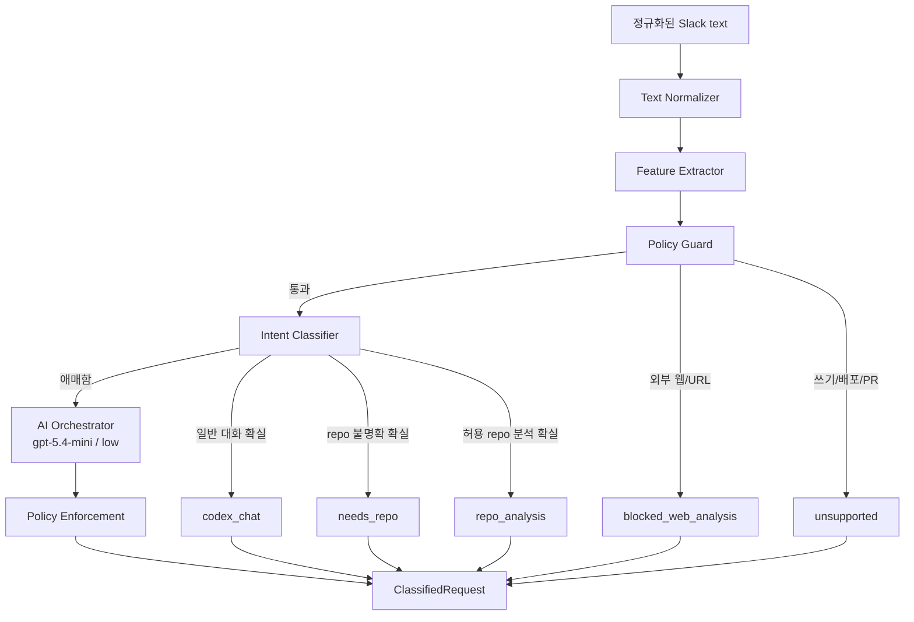

# 입력 가드레일

## 역할

입력 가드레일은 Slack에서 들어온 요청을 AI에 보내기 전에 코드로 먼저 판정하는 1차 관문이다.

단순 차단기가 아니라 아래 책임을 함께 가진다.

- 외부 웹/URL 분석 요청 차단
- 코드 수정, PR 생성, 배포, commit/push 같은 MVP 범위 밖 요청 차단
- 허용 repo key가 명확한 read-only 분석 요청 판정
- repo 분석 의도는 있지만 repo가 불명확한 요청 판정
- 일반 대화 요청 판정
- 코드로 확신하기 어려운 요청만 AI Orchestrator에 위임

## 처리 순서

```text
SlackCommand text
-> Text Normalizer
-> Feature Extractor
-> Policy Guard
-> Intent Classifier
-> Confidence Scorer
-> ClassifiedRequest 또는 AI Orchestrator 위임
```

입력 가드레일이 확실히 판단한 요청은 Codex CLI Orchestrator를 호출하지 않는다.
AI Orchestrator는 입력 가드레일이 `ambiguous`로 남긴 요청만 보조 판정한다.

## Mermaid



## Feature

가드레일은 문자열 keyword를 직접 흩뿌리지 않고, 먼저 요청 feature를 뽑는다.

| Feature | 의미 |
| --- | --- |
| `repo_key` | 원문에서 찾은 허용 repo key |
| `has_url` | URL 또는 Slack link 포함 |
| `has_web_intent` | 웹, 검색, 뉴스, 기사, 블로그 등 외부 정보 요청 |
| `has_write_intent` | 수정, 구현, 리팩터링, PR, commit, push, 배포 요청 |
| `has_repo_target` | repo, 저장소, 코드, 프로젝트 등 repo 대상을 가리킴 |
| `has_analysis_intent` | 분석, 구조, 흐름, 원인, 에러, 문제 등 코드 확인 의도 |
| `has_chat_intent` | 인사, 감사, 간단한 일반 대화 |
| `has_secret_risk` | `.env`, token, secret, key 등 민감 정보 열람 가능성 |

## 판정 우선순위

```text
1. URL/웹 분석 요청은 blocked_web_analysis
2. 수정/PR/배포/commit/push 요청은 unsupported
3. secret 열람 가능성이 있는 요청은 unsupported
4. 허용 repo key + 분석 의도는 repo_analysis
5. repo/코드 분석 의도 + repo key 없음은 needs_repo
6. 일반 대화 또는 일반 텍스트 작업은 codex_chat
7. 위 규칙으로 확신하기 어려운 요청만 ambiguous
```

## AI Orchestrator 위임 기준

AI Orchestrator는 기본 경로가 아니다.

아래처럼 코드 규칙만으로 의도가 모호한 요청만 위임한다.

```text
어제 말한 그거 봐줘
그거 괜찮은지 판단해줘
이 흐름 좀 봐줘
```

반대로 아래 요청은 AI Orchestrator를 호출하지 않는다.

```text
안녕
PopPang-iOS 구조 분석해줘
레포 분석해줘
https://example.com 분석해줘
PopPang-iOS 수정해줘
```

## 안전 원칙

- AI Orchestrator가 repo를 고르더라도 원문에 명시된 허용 repo key가 아니면 `repo_analysis`로 보내지 않는다.
- `should_create_job`은 `repo_analysis`일 때만 true가 될 수 있다.
- 입력 가드레일은 사용자 입력을 shell command로 실행하지 않는다.
- 입력 가드레일은 원본 repo path를 직접 받지 않는다.
- 민감 정보 열람 요청은 Codex에 보내기 전에 차단한다.

## 테스트 기준

- 일반 대화는 AI Orchestrator를 호출하지 않고 `codex_chat`으로 분류된다.
- 허용 repo key가 명시된 분석 요청은 AI Orchestrator를 호출하지 않고 `repo_analysis`로 분류된다.
- repo 분석 의도는 있지만 repo key가 없으면 AI Orchestrator를 호출하지 않고 `needs_repo`로 분류된다.
- URL/웹 요청은 AI Orchestrator를 호출하지 않고 `blocked_web_analysis`로 분류된다.
- 수정/PR/배포/commit/push 요청은 AI Orchestrator를 호출하지 않고 `unsupported`로 분류된다.
- 애매한 요청만 AI Orchestrator를 호출한다.
