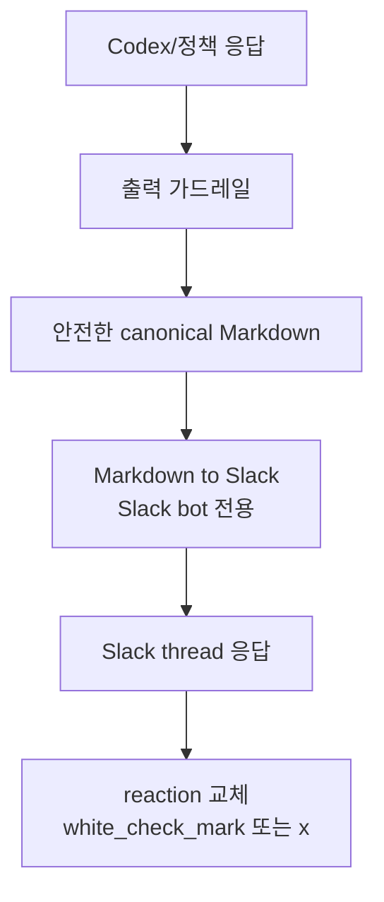

# 출력 파이프라인

## 역할

출력 파이프라인은 팡이가 만든 응답을 Slack thread에 보내기 전에 안전하고 읽기 좋은 형태로 정리한다.

최종 흐름은 단순하게 유지한다.

```text
출력 가드레일
-> Markdown to Slack
-> Slack thread 응답
-> reaction 교체
```

## Mermaid



## 출력 가드레일

출력 가드레일은 Slack 전용 포맷 변환을 하지 않는다.
팡이의 모든 외부 출력에 사용할 수 있는 안전한 canonical Markdown을 만든다.

책임:

- secret redaction
- Slack/외부 출력 길이 제한
- 빈 응답 fallback
- 제어 문자 제거
- `@channel`, `@here`, `@everyone` 같은 broadcast mention 무력화

현재 구현 위치:

```text
pangi/src/pangi/usecase/output_guardrail.py
```

## Markdown to Slack

Markdown to Slack은 Slack bot 응답에서만 사용한다.
관리자 페이지나 나중에 만들 관리자 채팅봇은 출력 가드레일이 만든 canonical Markdown을 직접 렌더링할 수 있으므로, Slack mrkdwn 변환을 거치지 않는다.

현재 구현 위치:

```text
pangi/src/pangi/infra/slack/markdown_to_slack.py
```

적용 위치:

```text
pangi/src/pangi/infra/slack/client.py
```

즉, usecase는 안전한 Markdown까지만 만들고, Slack Web API adapter가 Slack 전용 mrkdwn으로 변환한다.

## 변환 규칙

| Markdown | Slack 출력 |
| --- | --- |
| `# 제목`, `## 제목` | `*제목*` |
| `**강조**` | `*강조*` |
| `[텍스트](https://...)` | `<https://...|텍스트>` |
| `` | `<https://...|alt>` |
| `- 항목`, `* 항목`, `+ 항목` | `- 항목` |
| `1. 항목` | 그대로 유지 |
| `> 인용` | 그대로 유지 |
| inline code | 그대로 유지 |
| fenced code block | 내부 변환 없이 그대로 유지 |
| Markdown table | code block으로 감싸 깨지지 않게 표시 |

## 읽기 규칙

- 제목 뒤에는 빈 줄 하나를 둔다.
- 긴 문단의 줄바꿈은 유지한다.
- 코드블록 내부에서는 링크, bold, 리스트 변환을 하지 않는다.
- Slack이 지원하지 않는 Markdown 문법은 과하게 흉내 내지 않고 plain text 또는 code block으로 낮춘다.
- Slack 알림을 유발하는 broadcast mention은 출력 가드레일에서 먼저 무력화한다.

## 테스트 기준

- 출력 가드레일은 secret을 redaction한다.
- 출력 가드레일은 빈 응답 fallback과 길이 제한을 적용한다.
- 출력 가드레일은 broadcast mention을 무력화한다.
- Markdown to Slack은 제목, 링크, bold, 리스트를 Slack mrkdwn으로 변환한다.
- Markdown to Slack은 fenced code block 내부를 변환하지 않는다.
- Markdown to Slack은 Slack Web API adapter 경계에서만 적용된다.
